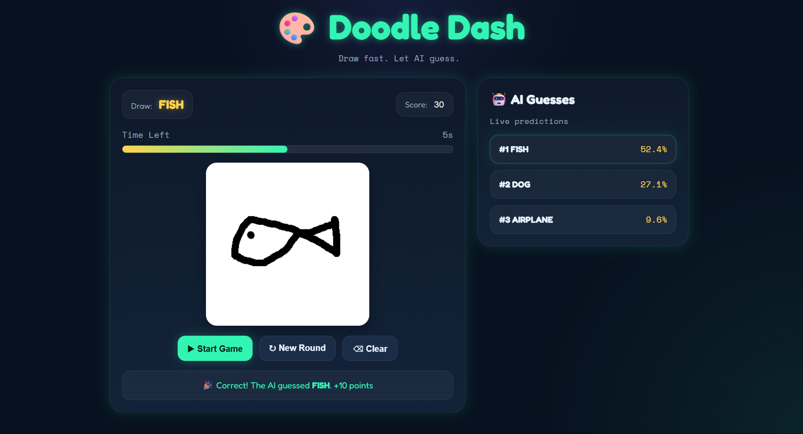
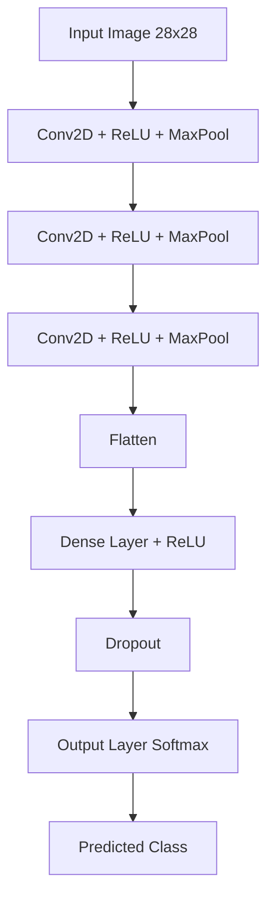

# 🎨 Doodle Dash

Doodle Dash is an **AI-powered drawing game** inspired by Google's QuickDraw.

Users draw an object on a canvas and a **Convolutional Neural Network (CNN)** tries to guess what it is in real time.

The project combines **Deep Learning, Computer Vision, and a full-stack web interface**.

---

## 🚀 Features

- 🎨 Interactive drawing canvas
- 🤖 Real-time AI predictions
- 🥇 Top 3 guesses from the model
- ⏱ Timer-based gameplay
- 🎯 Score tracking system
- ⚡ FastAPI backend for model inference
- 🧠 CNN trained on the QuickDraw dataset

---

## 🧠 Model

The model is a **Convolutional Neural Network (CNN)** trained on a subset of the **Google QuickDraw dataset**.

### Classes Used

- cat  
- dog  
- fish  
- car  
- apple  
- tree  
- house  
- star  
- crown  
- airplane  

### Input Processing

Images are converted to:

- grayscale
- resized to **28×28**
- normalized before being passed to the CNN

---

## 🏗 CNN Architecture

---

## 📂 Project Structure

Doodle Dash
│
├── backend
│   ├── app.py              # FastAPI server
│   ├── predict.py          # Model inference logic
│   └── model.py            # CNN architecture
│
├── frontend
│   ├── index.html          # Web interface
│   ├── style.css           # UI styling
│   └── script.js           # Game logic + API calls
│
├── data/                   # Dataset (ignored in Git)
│
├── doodle_dash_cnn.pth     # Trained CNN model
│
├── prepare_dataset.py      # Dataset preparation
├── train_cnn.py            # Model training script
│
├── X.npy                   # Training data (ignored)
├── y.npy                   # Training labels (ignored)
│
└── requirements.txt        # Python dependencies

---

## ▶️ Running the Backend

Navigate to the backend folder:
cd backend

Start the FastAPI server:
uvicorn app:app --reload

Backend will run at:
http://127.0.0.1:8000

---

## 🌐 Running the Frontend

Open the frontend folder and start a local server:
cd frontend
python -m http.server 5500

Then open:
http://127.0.0.1:5500

---

## 🎮 How to Play

1. Click **Start Game**
2. A random object prompt appears
3. Draw the object on the canvas
4. The AI will guess your drawing in real time
5. If the AI guesses correctly, you earn points

---

## 📊 Dataset

This project uses the **Google QuickDraw Dataset**, which contains millions of human drawings across hundreds of categories.

For this project, a subset of categories was selected and converted into **28×28 bitmap images**.

---

## 🔮 Future Improvements

- More drawing categories
- Better preprocessing for user drawings
- Multiplayer drawing mode
- Model accuracy improvements
- Online deployment

---

## 🛠 Tech Stack

- **Python**
- **PyTorch**
- **FastAPI**
- **HTML / CSS / JavaScript**
- **OpenCV**
- **NumPy**

---

## 📜 License

This project is open-source and available under the **MIT License**.
